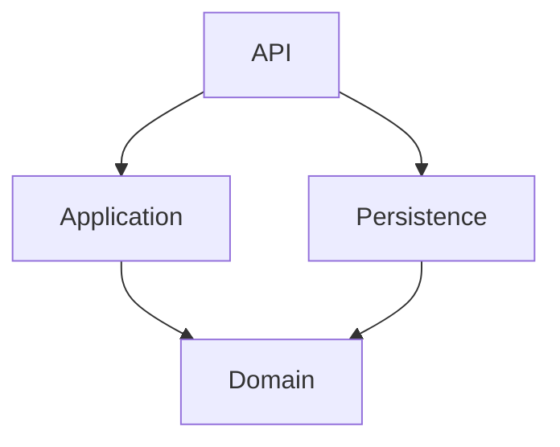

# BlogPlatform – Backend API (.NET 8 + Clean Architecture)

**BlogPlatform** is a backend API for managing blog posts, built with **.NET 8**, **Entity Framework Core**, and **Minimal APIs**. The project follows **Clean Architecture** principles and is **containerized using Docker**, allowing it to be executed via Docker Compose or directly from Visual Studio.

---

## Architecture

This project is structured according to Clean Architecture, separating responsibilities across defined layers:

```
BlogPlatform
├── Domain        → Core business entities and interfaces
├── Application   → Use cases (interactors) and DTOs
├── Persistence   → EF Core implementations and data access
├── API           → Minimal API endpoints and composition root
├── Tests         → Unit tests for application layer
```

### Dependency Flow Diagram



- `Domain` is completely isolated and does not reference any other project.
- `Application` depends only on `Domain`.
- `Persistence` implements interfaces defined in `Domain`.
- `API` depends on all layers and composes them via Dependency Injection.

---

## Technologies Used

| Technology              | Purpose                                  |
|--------------------------|-------------------------------------------|
| .NET 8                  | Core backend framework                   |
| Entity Framework Core   | ORM for PostgreSQL                       |
| PostgreSQL              | Relational database (via Docker)         |
| Docker + Docker Compose | Container orchestration                  |
| Minimal API             | HTTP endpoint structure                  |
| xUnit                   | Unit testing framework                   |
| Moq                     | Mocking library for unit tests           |
| FluentAssertions        | Readable assertions for tests            |
| Swagger / OpenAPI       | Automatic API documentation              |

---
## Requirements

In the localhost need to be installed the following technologies:
* Docker

---

## NuGet Dependency Installation

Before running the project locally (outside containers), make sure to restore all dependencies with the following command:

```bash
dotnet restore
```

This will install all NuGet packages required by the solution.

---

## Running the Project with Docker Compose

The entire application is containerized and can be started using Docker Compose:

```bash
docker-compose up --build
```

This will start the following services:

- `blogplatform.api` – The ASP.NET Core Web API
- `blogplatform.db` – The PostgreSQL database

After startup, the API will be accessible at:

```
http://localhost:8080/swagger
```

---
## First steps: IMPORTANT❗❗❗
After db is running execute the following command from the `Persistence` project path:
```
dotnet ef database update --project .\BlogPlatform.Persistence --startup-project .\BlogPlatform.API
```

That command will execute the first migration, in other words, it will create the BlogPost table in the database, if you try to use the API endpoints before execute the migration, the will return only errors.

---

## Running the Project from Visual Studio

You can also run the application locally from Visual Studio:

1. Ensure Docker is running and PostgreSQL is up via Docker, don't forget to apply the migration.
2. Open `BlogPlatform.API/appsettings.Development.json` and verify the connection string:

```json
"DefaultConnection": "Host=localhost;Port=5432;Database=blogdb;Username=postgres;Password=postgres"
```

3. Restore packages with:

```bash
dotnet restore
```

4. Run the project `BlogPlatform.API`.

Alternatively, you can use the **Docker Compose** launch profile from Visual Studio to run all services in containers.

---


## Unit Testing

Unit tests are included for application-layer use cases using **xUnit**, **Moq**, and **FluentAssertions**.

To run tests:

```bash
dotnet test BlogPlatform.Tests
```

### Use Cases Covered by Unit Tests

- Create a blog post (`CreateBlogPostUseCase`)
- Update a blog post (`UpdateBlogPostUseCase`)
- Retrieve blog posts (`GetBlogPostUseCases`)

---

## Design Decisions

- Clean Architecture was chosen to enforce separation of concerns and long-term maintainability.
- Dependency Inversion is applied: the application layer depends on interfaces from the domain layer, and implementations are injected at runtime.
- Minimal APIs are used to reduce boilerplate and keep the API layer concise.
- Entity Framework Core is used with the Code-First approach.
- Data annotations are preferred for simplicity instead of Fluent API configuration.
- Each use case is tested in isolation using mocks, without any dependency on the database.

---

## Final Thoughts

- Interesting challenge to apply DDD and Clean Architecture concepts.
- I like to use docker in my projects in order to have an easy portability, that is why I used doker compose to create the API and the DB.
- I selected Postgres as DB because I worked with it some times before and is the one that gave me the least number of compatibility issues in work and personal projects.
- I preferred to use .Net 8 just because previously I worked with .NET Framework and .Net Core 5/6 and I like to test new versions of technologies and new technologies.
- I had fun 😁
---

## License

This project is open source and may be used for educational or personal purposes.
